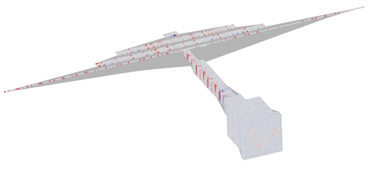

# NetGraph: A framework for graph based neural network exploration 

This package allows to create a graph from a neural network.
Visualization of the resulting network in tulpan.



# Example: Building LeNet


```python


from netgraph.netgraph import NetGraph

from keras.models import load_model

from netgraph.nets.data import data


model = load_model('weights/lenet-mnist.hdf5')

(x_train, x_train_raw, y_train), (x_test, x_test_raw, y_test) = data('mnist')


layers = NetGraph.keras_to_file(input=x_test[:1], file='lenet-mnist.gml')


x = layers.Input(name='conv2d_1_input')

x = layers.Conv2D(6, (5, 5), padding='valid', activation = 'relu', kernel_initializer='he_normal')(x)
x = layers.MaxPooling2D((2, 2), strides=(2, 2))(x)
x = layers.Conv2D(16, (5, 5), padding='valid', activation = 'relu', kernel_initializer='he_normal')(x)
x = layers.MaxPooling2D((2, 2), strides=(2, 2))(x)
x = layers.Flatten()(x)
x = layers.Dense(120, activation = 'relu', kernel_initializer='he_normal' )(x)
x = layers.Dense(84, activation = 'relu', kernel_initializer='he_normal' )(x)
x = layers.Dense(10, activation = 'softmax', kernel_initializer='he_normal' )(x)        


```


